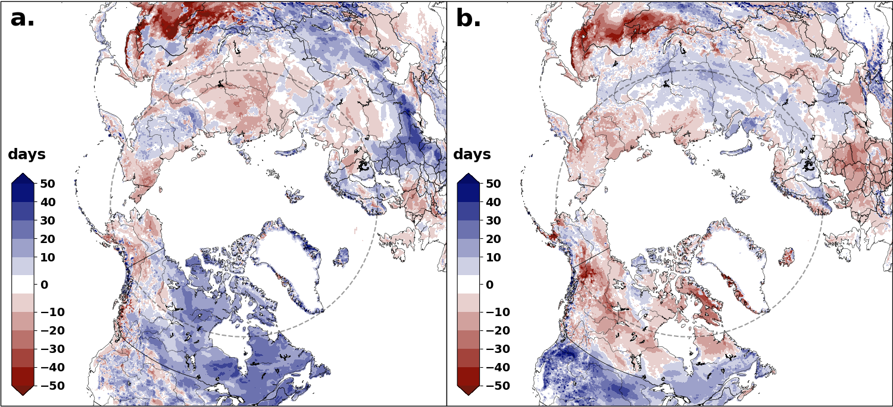
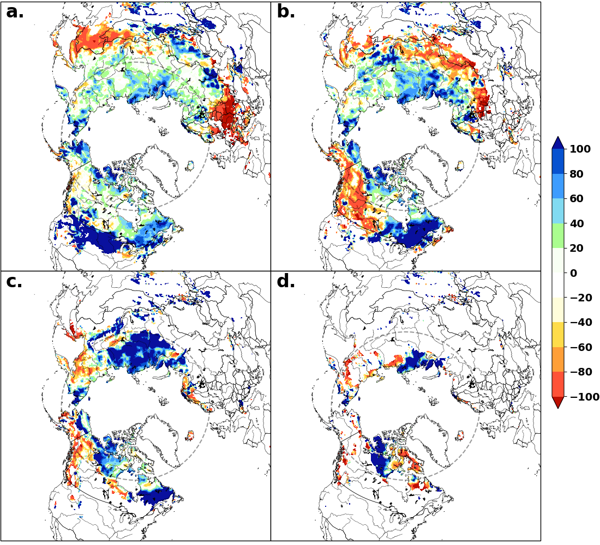

# Data Use:

- U.S. National Ice Center. 2008, updated daily. IMS Daily Northern Hemisphere Snow and Ice Analysis at 1 km, 4 km, and 24 km Resolutions, Version 1. 1998-2018. Boulder, Colorado USA. NSIDC: National Snow and Ice Data Center. doi: https://doi.org/10.7265/N52R3PMC. July 2, 2020.
- Brown, R. D. and B. Brasnett. 2010, updated annually. Canadian Meteorological Centre (CMC) Daily Snow Depth Analysis Data, Version 1. 1998-2018. Boulder, Colorado USA. NASA National Snow and Ice Data Center Distributed Active Archive Center. doi: https://doi.org/10.5067/W9FOYWH0EQZ3. July 6, 2020.
- *2020 CMC data from ECCC

# Snow Cover Duration (SCD_project sub-directory)

## Steps:

### Edit utils/constants.py 

- If needed, set DOWNLOAD_DATA = True
   * Downloads all the data files and coordinate grids
- If needed, set RUN_SETUP = True
   * Reformats IMS data to yearly NetCDF files
- Set IMS_DIR
   * This is where IMS daily data will be downloaded or is already downloaded
- Set IMS_files_loc
   * This is where reformatted IMS files in NetCDF format will be saved
- Set current year (current_y) and the most recent downloaded day (max_day_downloaded)
   * If max_day_downloaded is changed, set max_day_change = True
   * If max_day_downloaded is not changed, max_day_change = False

### Check utils/IMS_tools.py

- If it is a new year, update 'missing' and 'unpacked' dictionaries appropriately with missing or unpacked days (probably, they will be empty, but there needs to be an entry for every year in the record)

### Edit SCD_anomaly_calc.py

- Adjust CLIM_MIN and CLIM_MAX to reflect the period of time desired for the snow cover duration climatology calculation
   * E.g. for period Aug 1998 to July 2017, CLIM_MIN = 1998 and CLIM_MAX = 2017
- Set year_of_interest as shown (In the form [YYYY, YYYY+1])
- This script produces a NetCDF file containing anomalous fall and spring SCD for the year of interest (Aug-July) relative to selected climatological period

### Run SCD_anomaly_calc.py

- Takes approx. a minute to run (writing to file is probably the slow part)
- The following is the procedure within: 

0. If DOWNLOAD_DATA = True, 
   * 1998-current_y IMS data downloaded via FTP using fetch_data.py functions to IMS_DIR
   * Lat/lon binary files also downloaded to IMS_DIR

0. If RUN_SETUP = True
   * Raw datasets are grouped by year into NetCDF files, with lat/lon grids attached as 2D coordinate variables, these are saved to IMS_files_loc
   * The correct files are loaded from the raw data using the path provided by utils.IMS_tools function file_and_date, see flowchart below for logic (note: v1.3 files are named one day off - file named with '002' corresponds to Jan 1)

0. If max_day_change = True,
   * Current_y IMS data downloaded via FTP using fetch_data.py functions to IMS_DIR
   * New NetCDF file for current_y is made, saved to IMS_files_loc - see fourth bullet point in step above for details

1. Given CLIM_MIN and CLIM_MAX, data between August, CLIM_MIN and July, CLIM_MAX is read into an xarray Dataset. 

2. Only snow-filled grid squares are left unmasked, and they are replaced with a value of 1

3. By resampling to 6-monthly frequency through a sum, the Dataset has SCD for each season in the study period specified by CLIM_MIN-CLIM_MAX

4. Taking the mean through the years gives the climatological SCD for autumn (entry with season='SON') and spring (entry with season = 'MAM')

5. Data for the year_of_interest (e.g. year = [2018, 2019] is the snow season Aug 2018-July 2019) is loaded into an xarray Dataset, the SCD is calculated for the two seasons as before

6. Difference between current SCD and climatological SCD is calculated

7. anom_to_netcdf function is used to produce a NetCDF file containing autumn and spring SCD anomalies for a given year_of_interest

# Snow Depth (SD_project sub-directory)

## Steps

### Edit utils/constants.py

- If this is the first run, set DOWNLOAD = True and RUN_SETUP = True
   * This will download all publicly available snow depth files, coordinate grids, homogeneity and land-sea masks
   * Data will be grouped into yearly NetCDF files
- Set CMC_DIR
   * This is where the CMC snow depth analysis data will be downloaded or is already downloaded
- Set CMC_files_loc 
   * This is where reformatted CMC files in NetCDF format will be saved

### Edit SD_calc.py

- Adjust lines 34-37 as needed, listing months for which to calculate climatological snow depth and anomaly, the reference year, as well as the climatological period.
- This script saves climatological snow depth in separate files for each month selected, as well as separate files by month for anomaly in snow depth (%) - both saved as NetCDF files

### Run SD_calc.py

- Should print what month is being calculated and which data is being saved (climatological or anomaly)
- The procedure within:

0. If DOWNLOAD = True in constants.py, publicly available CMC snow depth data will be downloaded to CMC_DIR. If, additionally, RUN_SETUP = True, data will be reformatted into a NetCDF file with the coordinate grid attached. For full years, there are 12 entries in each year's NetCDF file, attached to the first day of each month, representing the monthly snow depth associated with that month.
   * fetch_data.py contains functions that perform this download

0. If RUN_SETUP = True
   * Raw datasets are grouped by year into NetCDF files, with lat/lon grids attached as 2D coordinate variables

1. Using lines 34-37, a loop is set up
   * For each month selected:
      1. Data to calculate the climatology is loaded
      2. Calculation is performed
      3. Month is selected
      4. Homogeneity and land-sea mask are applied to return land-only points
      5. Climatological data for that month is saved to NetCDF
      6. 1-3 are repeated
      7. Year of interest is loaded, month is selected
      8. Anomaly calculated as (data-clim)/clim * 100 , and that is saved to NetCDF
         *Note for anomaly calculation, values less than 1e-5 are masked out to avoid divison by zero errors
      9. Homogeneity and land-sea mask are applied to return land-only points
      10. Anomaly data for month is saved to NetCDF

# SCD anomaly figure for 2018/19 winter season 

## Figure was created as follows:

1. In SCD_project/SCD_anomaly_calc.py, CLIM_MIN = 1998, CLIM_MAX = 2017, year_of_interest = [2018, 2019]
2. Run SCD_anomaly_calc.py
   * Grid squares where climatological snow depth is < 1cm for given month are masked out
3. In plotting/snow_fig_2.py, data_file='anom_SCD_2018_to_2019.nc'
4. Run snow_fig_2.py

# SD anomaly figure for 2018/19 winter season 

## Figure was created as follows:

1. In SD_project/SD_calc.py, month_s_of_interest = [3, 4, 5, 6], year_of_interest = 2019, clim_min = 1998, clim_max = 2017
2. Run SD_calc.py
3. In plotting/snow_fig_3.py, clim_min = 1998, clim_max = 2017, year_interest = 2019
4. Run snow_fig_3.py

